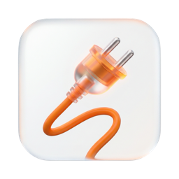
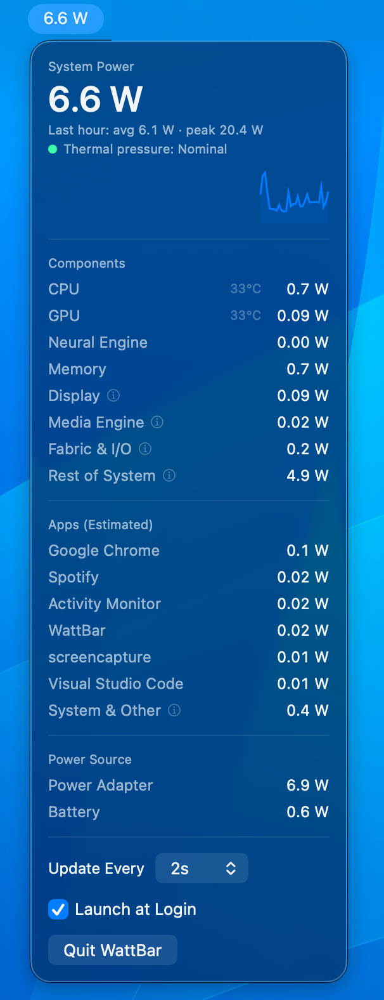

<p align="center">
  
</p>

# WattBar

A macOS menu bar app that shows your Mac's live power draw in watts, no sudo required.

WattBar exists mainly because iStat Menus can no longer read power sensors on M5-series Macs. It is inspired by iStat Menus and [mactop](https://github.com/context-labs/mactop), but lives in the menu bar instead of a terminal.

<p align="center">
  
</p>

## Features

- **Live system power** in the menu bar (e.g. `22.5 W`), updating at a configurable interval (0.5s / 1s / 2s / 5s)
- **Component breakdown**: CPU, GPU, Neural Engine, Memory, Display, Media Engine, and Fabric & I/O power, with CPU/GPU die temperatures, plus a "Rest of System" residual (display backlight, SSD, radios, conversion losses)
- **Per-app power estimates**: the activity-driven share of system power (CPU, memory, fabric, and load-dependent overhead) distributed across apps by their share of machine-wide CPU time, including short-lived child processes like compilers, which roll up into their parent app. Apps plus "System & Other" add up to the system total.
- **Last-hour history**: time-weighted average, peak, and a sparkline chart
- **Thermal pressure** indicator (Nominal / Fair / Serious / Critical)
- **Power source** rows: adapter draw and battery draw
- **Launch at login** (on by default, toggleable)

## Why no sudo?

Tools built on `powermetrics` need root. WattBar reads the same underlying data from sources that don't:

| Data | Source |
|---|---|
| System / adapter / battery power | SMC keys (`PSTR`, `PDTR`, `PPBR`) via IOKit |
| CPU / GPU / ANE / DRAM power | IOReport "Energy Model" energy counters |
| CPU / GPU temperature | SMC `Tp*` / `Te*` / `Tg*` sensor keys |
| Per-app attribution | `proc_pid_rusage` CPU time + child-reap counters, budgeted against the measured activity-driven power (CPU, memory, fabric, load-dependent overhead) |

## Requirements

- Apple Silicon Mac
- macOS 15+
- Xcode command line tools

## Install

Download the zip from the [latest release](https://github.com/jameseunson/WattBar/releases/latest), unzip, and move `WattBar.app` to `/Applications`. The app is ad-hoc signed (not notarized), so on first launch right-click → **Open** → **Open**, or run `xattr -d com.apple.quarantine WattBar.app`.

## Build from source

```sh
./build.sh
open WattBar.app
```

## Debug CLI

The binary doubles as a command-line probe:

```sh
.build/release/WattBar --probe         # one reading of every power/temp source
.build/release/WattBar --apps          # per-app power estimate over 2 seconds
.build/release/WattBar --components    # bucketed component breakdown, as shown in the panel
.build/release/WattBar --dump          # every raw SMC power sensor
.build/release/WattBar --login-status  # login item registration state
```

## Accuracy notes

- Per-app figures budget the **activity-driven share of system power**: CPU package, memory, and fabric power, plus the part of "Rest of System" above its idle floor (mostly power-conversion losses, which scale with load). The floor is estimated as a low percentile of the last hour of residuals.
- Memory, fabric, and overhead are split by CPU-time share, a proxy for the actual per-app traffic.
- GPU, Neural Engine, and Media Engine power has no per-app counter and stays in "System & Other", so GPU-heavy apps are underestimated.
- "System & Other" is the remainder against the system total: the fixed baseline (backlight, SSD, radios), unattributable component power, and CPU time from privileged system processes (Spotlight, WindowServer, security daemons) that can't be read without root. Apps plus this row add up to the headline figure.
- E-core and P-core seconds are weighted equally, so light background apps are slightly overestimated relative to heavy P-core work.

## Credits

WattBar was vibecoded: the code was written by [Claude Fable 5](https://www.anthropic.com/news/claude-fable-5-mythos-5) (Anthropic) via Claude Code, with direction, testing, and product decisions by James Eunson. Commits carry a `Co-Authored-By: Claude Fable 5` trailer.

The approach to sudo-free power monitoring was informed by reading the [mactop](https://github.com/context-labs/mactop) source (MIT, Carsen Klock), and the per-app power feature takes its inspiration from iStat Menus.

## License

MIT
